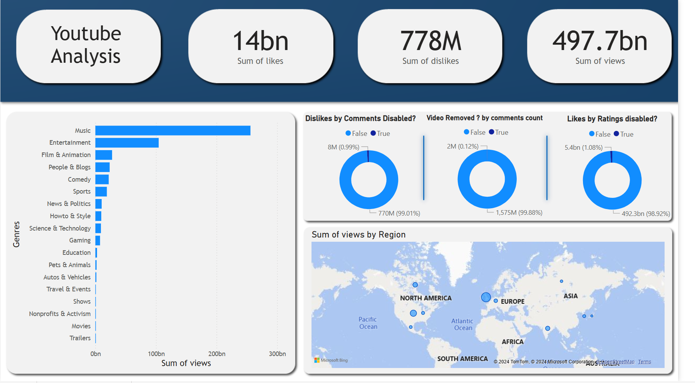
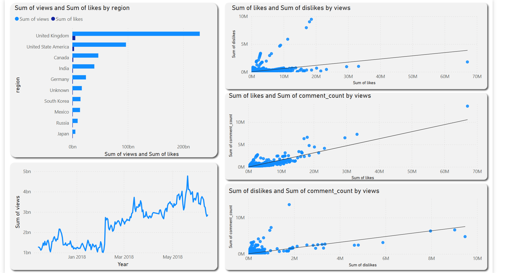

# YouTube-Video-Popularity-Analysis
This project involved designing and implementing a robust data pipeline to analyze the factors influencing the popularity of YouTube videos, leveraging big data tools and techniques.
Utilizing PySpark for ETL, PostgreSQL for data storage, and Power BI for dashboard visualization.
Below is a detailed overview of the project:

1. Data Extraction
      Reads regional YouTube datasets provided in CSV format, containing metrics like views, likes, dislikes, and comment counts.
      Extracts metadata from JSON files, including video categories and channel information.
   
2. Data Transformation
      Standardizes and cleans the data to ensure uniformity across all regions.
      Enriches the dataset by joining regional metrics with metadata, mapping category IDs to meaningful labels.
      Adds contextual information, such as region names, for better analysis.

3. Data Integration
      Combines data from multiple regions into a unified dataset for global analysis.
      Ensures consistent encoding (UTF-8) to handle diverse character sets.

4. Data Storage:
      Loaded the transformed data into a PostgreSQL database for efficient storage and querying.
      

5. Dashboard Results:
     
     
       

   
